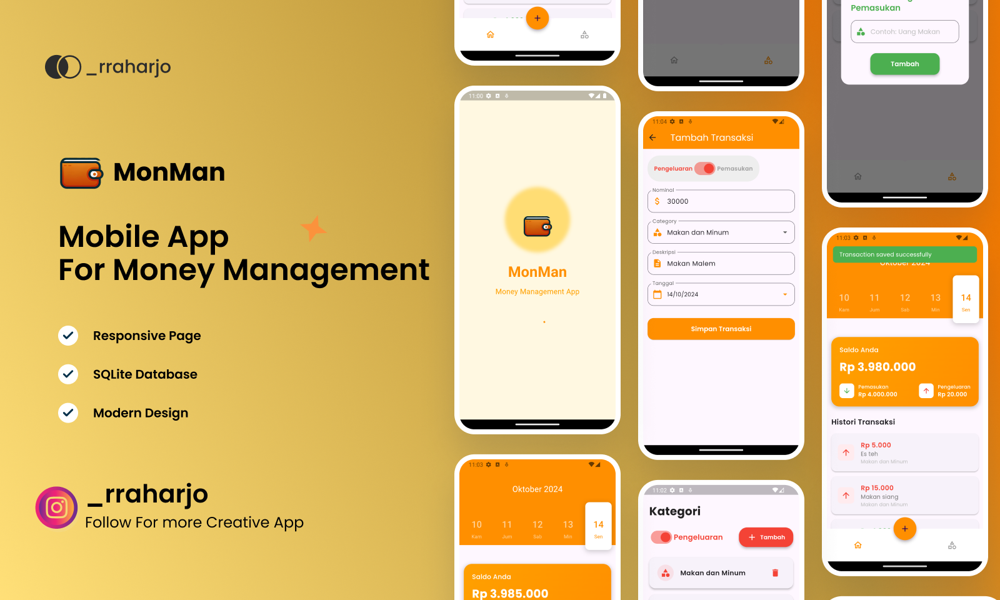

# Monman - Personal Money Management App

Monman is a personal money management application built to help you track, record, and manage your finances effortlessly. This app is designed with simplicity and functionality in mind, enabling users to monitor their spending habits, set financial goals, and analyze their financial health in one place.

## Features

- **Expense Tracking**: Easily log daily transactions, from income to expenses, and categorize them for clear insights.
- **Budget Management**: Set budgets for different categories to help you control your spending and reach your savings goals.
- **Financial Insights**: View detailed reports and charts that provide a visual breakdown of your spending and earnings.
- **SQLite Database**: Data is stored locally using SQLite, ensuring fast access and secure storage.
- **Responsive Design**: Optimized for various screen sizes, providing a seamless experience across all mobile devices.
- **Flutter**: Built using Flutter for a native-like experience on both Android and iOS platforms.

## Screens

- **Dashboard Screen**: A central hub that provides an overview of your financial status, including total balance, recent transactions, and financial trends.
- **Category Screen**: Organize your transactions by categories such as Food, Transport, and Entertainment. This helps you get a detailed breakdown of your expenses across different categories.
- **Add Transaction Screen**: Quickly add new transactions with ease. Input the amount, choose a category, and specify whether it's an income or expense.
- **History Screen**: View a complete log of all your past transactions in chronological order, with filters to search by date, category, or amount.
- **Calendar Screen**: Visualize your spending habits over time using a calendar view. Built with the **calendar_appbar** package, this screen allows users to browse through dates and track daily transactions easily.


## Getting Started

To get started with this project:

1. Clone the repository:
   ```bash
   git clone https://github.com/kun-genos/monman.git
   ```
2. Navigate to the project directory:
   ```bash
   cd monman
   ```
3. Install the dependencies:
   ```bash
   flutter pub get
   ```
4. Run the app:
   ```bash
   flutter run
   ```

## Contribution

Contributions are welcome! If you have ideas for improvements or new features, feel free to fork the repository, create a new branch, and submit a pull request.

## License

This project is licensed under the MIT License - see the LICENSE file for details.
